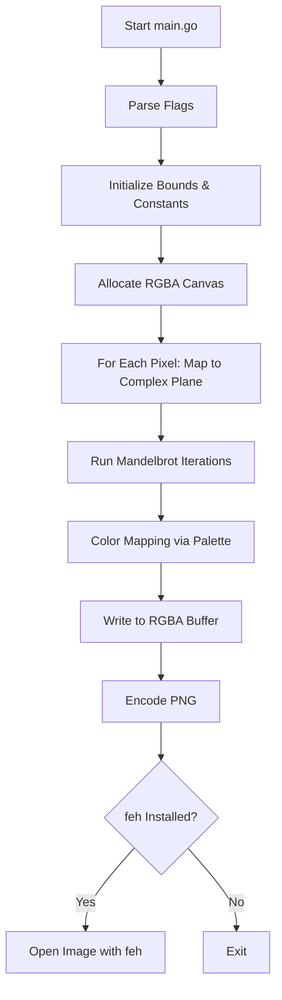

# Mandelbrot Renderer (Go)

> See image and diagram below

A fast, extensible Mandelbrot fractal generator written in Go.\
Supports multiple color palettes, configurable image dimensions,
iteration limits, and automatic image preview using **feh** on Linux.

------------------------------------------------------------------------

## Features

-   High‑performance Mandelbrot set renderer in Go
-   Multiple color palettes (e.g., `MonochromeSlate`, `Inferno`,
    `Plasma`, etc.)
-   Custom image sizing and iteration depth
-   PNG output
-   Optional automatic preview via `feh`
-   Clean and simple CLI interface

------------------------------------------------------------------------

## Example Usage

This is the exact command sequence used during development:

``` bash
🦀 whaler@fedora ~/github/mandlebrot (git)-[main]- go run main.go     -palette MonochromeSlate     -outfile /outfile/monochrome_mandlebrot.png
```

The application will:

1.  Parse flags\
2.  Generate the fractal\
3.  Apply the selected palette\
4.  Save the PNG to the output file\
5.  Automatically open it in `feh` (if available)

------------------------------------------------------------------------

## Command-Line Flags

  ------------------------------------------------------------------------
  Flag              Type              Description
  ----------------- ----------------- ------------------------------------
  `-palette`        string            Selects a named color palette (e.g.,
                                      `MonochromeSlate`)

  `-outfile`        string            Path where the generated PNG will be
                                      written

  `-width`          int               Image width in pixels

  `-height`         int               Image height in pixels

  `-iters`          int               Max iteration depth for escape-time
                                      algorithm
  ------------------------------------------------------------------------


<br>
Example:

``` bash
go run main.go -width 1920 -height 1080 -iters 1500 -palette Inferno -outfile fractal.png
```
<br>

------------------------------------------------------------------------

## Architecture Diagram


---

<br>

## Rendered Mandlebrot Image with "NebulaSpectre" flag. 
e.g. `go run main.go -palette "NebulaSpectre" -outfile /nebspec.png`
<br>


---

<br>

------------------------------------------------------------------------

## Dependencies

-   Go 1.21+\
-   (Optional) `feh` for image preview on Linux

Install `feh` on Fedora:

``` bash
sudo dnf install feh
```

------------------------------------------------------------------------

## Running Without feh

If you prefer not to open the file automatically, either uninstall `feh`
or modify the code block that triggers:

``` go
exec.Command("feh", outfile).Start()
```

------------------------------------------------------------------------

## Output Example

Once rendered, the program will generate a high-resolution PNG such as:

    /outfile/monochrome_mandlebrot.png

Suggested palettes for stylish renders:

-   MonochromeSlate
-   NebulaSpectre
-   BlueInferno
-   Nebula
-   MetallicChrome
-   ThermalHeat 
-   AuroraArc

------------------------------------------------------------------------

## Project Structure

    mandlebrot/
    │
    ├── README.md
    ├── /palette/palettes.go
    ├── outfile/nebula_mandlebrot.png
    ├── go.mod
    └── main.go

------------------------------------------------------------------------

## License

MIT License.\
Feel free to modify, extend, or incorporate this renderer into your own
projects.

------------------------------------------------------------------------

## Author

**whalelogic / Keith**\
Developer, cloud engineer, and fractal enthusiast.


